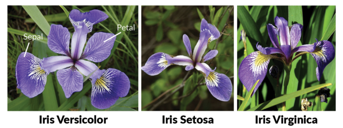

<div align="center">
    <p>Learn · Create · Master</p>
    <h1>Simple ML Iris Flower prediction model Scikit-learn dataset 👀</h1>
    <p>This is a simple project I initially did for fun in 2020. Putting it up on GitHub to share and if possible have some pass time, over the weekend collaborative work done on it. What was this project initially intended to do? Learn how to build a simple prediction model using <a href="https://scikit-learn.org/stable/index.html">Scikit-learn</a> and the Iris Flower dataset.</p>
    
</div>

<div align="center">
    
</div>

## ⚙ **_Install_**

```python
# Just run it
```

## 📃 **_Todo_**:

-   [x] _Import dataset_
-   [x] _Get data_
-   [x] _Split data. Training & Test Set_
-   [x] _Create model - using NeighborsClassifier_
-   [x] _Create model - using DecisionTreeClassifier_
-   [x] _Test model_
-   [x] _Save model_
-   [x] _Test saved model_
-   [ ] _Improve prediction_
-   [ ] _Plotting_
    -   [ ] _Data visualization_

## 🐱‍👤 **_Contribute_**

1. **Fork** it!
2. **Create** your feature branch: `git checkout -b my-new-feature`
3. **Commit** your changes: `git commit -am 'Add some feature'`
4. **Push** to the branch: `git push origin my-new-feature`
5. **Submit** a pull request

## 🧠 **_Contributors_**

<!-- ALL-CONTRIBUTORS-LIST:START - Do not remove or modify this section -->
<!-- prettier-ignore -->
| [<br /><sub><b>Vikash Chand</b></sub>](https://vikash.ch/)<br />[📖](https://github.com/vikichand//commits?author=vikichand "Documentation") [💻](https://github.com/vikichand/simple-web-scraping-beautifulsoup-hackernews/commits?author=vikichand "Code") [🎨](#design-vikichnad "Design") [💡](#example-vikichnad "Examples") |
| :--------------------------------------------------------------------------------------------------------------------------------------------------------------------------------------------------------------------------------------------------------------------------------------------------------------------------------------------------------------------------------------------------: |

<!-- ALL-CONTRIBUTORS-LIST:END -->
